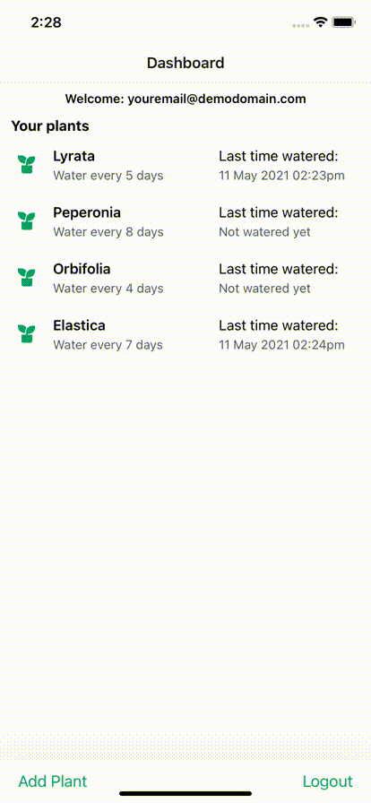
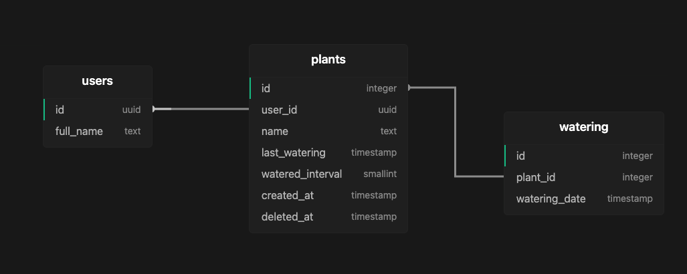

# STRV FRONTEND TALK - SUPABASE, AN UP-AND-COMING FIREBASE ALTERNATIVE

- [Intro](#intro)
- [Setup](#setup)
  - [Step 1. Setup React Native Environment](#react-native)
  - [Step 2. Setup Supabase](#supabase)
- [Tech Stack](#tech-stack-mentions)



## Intro

This is a demo accompanying [STRV Frontend Talk](https://www.eventbrite.com/e/online-frontend-talk-supabase-an-up-and-coming-firebase-alternative-tickets-153504601395?aff=ebdsoporgprofile) showcasing Supabase (auth, database, storage) API integration into a React Native plants-watering application. The git history is split into presentable pieces to demonstrate Supabase API integration. A first commit is a boilerplate skeleton with all neccessary UI and libraries in place. **To replicate the application, stay at the latest commit and follow the tutorial bellow.**

## Setup

To make the application run, you have to first setup React Native environment. Then install dependencies and build application for your selected platform. Finally create a new project in Supabase, update `.env` file with your credentials, and create tables and policies to enable the application.

### React Native

- Follow [React Native](https://reactnative.dev/docs/environment-setup) (CLI) setup
- Or alter the code to framework of your choice

### Scripts

#### First step

Run `yarn` command.

##### iOS

Run `pod install` in `ios` folder.
Run `react-native run-ios`.

##### Android

Run `react-native run-android`.

### Supabase

- [Start a new project](https://app.supabase.io/)
- Navigate to `Settings` - `API` and copy `database url` and `anon key` into `.env.example` file. Rename the file to `.env`.

> After changing environment variables, make sure to rebuild the application with scripts as above.

- Navigate to `Authentication` - `Settings` and disable `email confirmations`.
- Follow steps bellow to replicate this schema:
  

#### 1. Create Users Table

- in Supabase SQL editor run following queries

```
create table users (
  -- UUID from auth.users
  id uuid references auth.users not null primary key,
  full_name text
);

alter table users enable row level security;
create policy "Can view own user data." on users for select using (auth.uid() = id);
create policy "Can update own user data." on users for update using (auth.uid() = id);


/**
* This trigger automatically creates a user entry when a new user signs up via Supabase Auth.
*/
create function public.handle_new_user()
returns trigger as $$
begin
  insert into public.users (id)
  values (new.id);
  return new;
end;
$$ language plpgsql security definer;

create trigger on_auth_user_created
  after insert on auth.users
  for each row execute procedure public.handle_new_user();
```

#### 2. Create plants table

- in Supabase SQL editor run following queries

```
create table plants (
  id serial not null primary key,
  user_id uuid references users not null,
  name text not null,
  last_watering timestamp with time zone,
  watered_interval int2,
  created_at timestamp with time zone default timezone('utc'::text, now()) not null,
  deleted_at timestamp with time zone
);

alter table plants enable row level security;
create policy "Can view own plants data." on plants for select using (auth.uid() = user_id);
create policy "Can update own plants data." on plants for update using (auth.uid() = user_id);
create policy "Can insert own plants data." on plants for insert with check (auth.uid() = user_id);
create policy "Can delete own plants data." on plants for delete using (auth.uid() = user_id);
```

#### 3. Create watering table

- in Supabase SQL editor run following queries

```
create table public.watering (
  id serial not null primary key,
  plant_id serial references public.plants not null,
  watering_date timestamp with time zone default timezone('utc'::text, now()) not null
);

create or replace function public.handle_new_watering()
returns trigger as $$
declare
  returned record;
begin
    if new is null then
    returned = old;
    else
    returned = new;
    end if;

    update public.plants
    set last_watering =
      (select watering_date from watering
      -- here we filter watering logs
      where plant_id = returned.plant_id
      order by watering_date desc limit 1)
    -- here we filter the plants table
    where id = returned.plant_id;

    return returned;
end;
$$ language plpgsql security definer;

create trigger on_watering
  after insert or delete on public.watering
  for each row execute procedure public.handle_new_watering();
```

#### 4. Setup storage

- In your Supabase project navigate to `Storage`
- Create `New bucket` called `plants` (name is important)
- Click `Policies` and disable `Row Level Security` for `Buckets` (a lock icon)
- Click `Add policy` for `Objects`.
  - Toggle `Advanced`, select `All`.
  - Input any `Policy name`.
  - Set `Definition` to `auth.uid() = owner` with type `Permissive`.

## Tech stack mentions

- [React Native](https://reactnative.dev/) as the backbone.
- [Typescript](https://www.typescriptlang.org/) for type safety.
- [React Native UI Lib](https://github.com/wix/react-native-ui-lib) for styling.
- [React Query](https://react-query.tanstack.com/) for API management.
- [react-native-url-polyfill](https://github.com/charpeni/react-native-url-polyfill) for Supabase API calls to work.
- [STRV Code Quality Tools](https://github.com/strvcom/code-quality-tools) for code quality and consistency.
